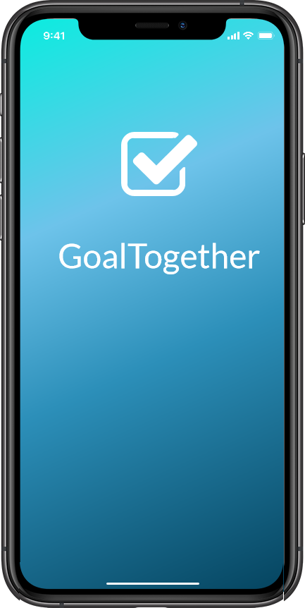
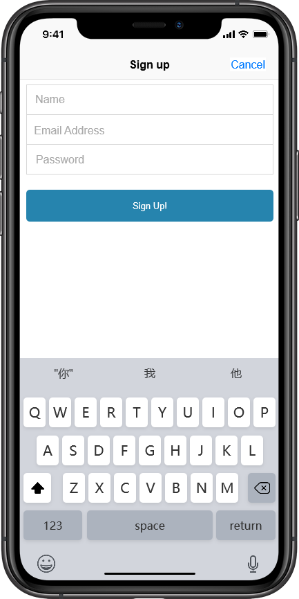
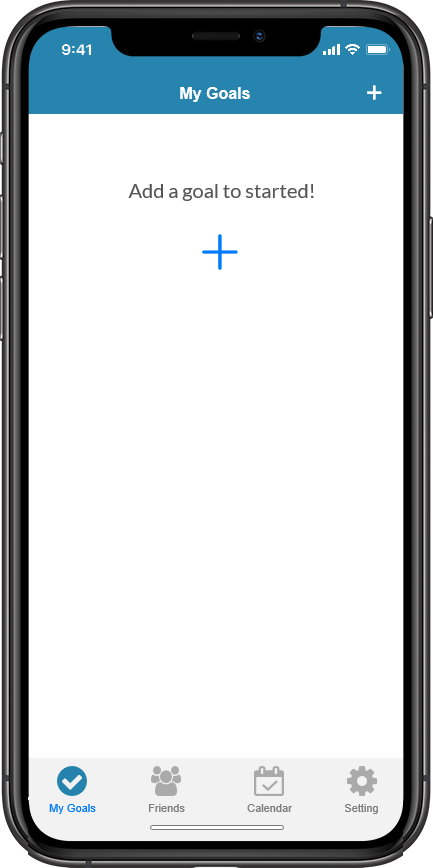
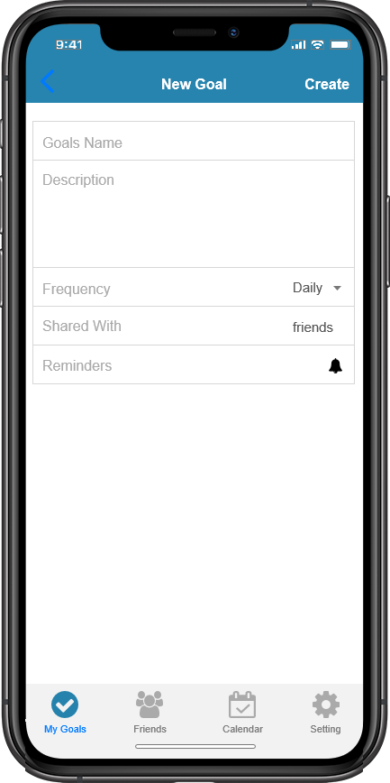
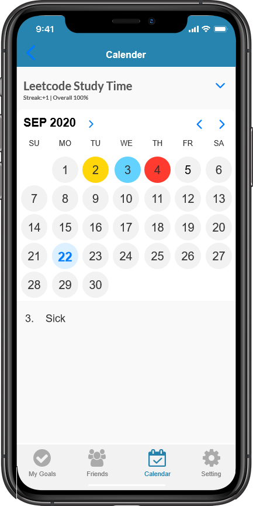

# goaltogether
Covid-19 has brought changes to our social manner. Concerts and parties are canceled, people have limited ways to connect with other people. The coronavirus is here forever. We need to know how to live with it. We hope to use technology to help us recommend new friends. Covid-19 has also brought trauma. From August 2020 to February 2021, the number of adults with recent symptoms of an anxiety or depressive disorder increased by more than 40%. Many Covid-19 emotional support helplines are set up to connect with people facing emotional problems. However, due to the lack of volunteers and reluctance to seek help from unknown people, few people can get proper support when facing emotional problems. In the background of living with covid-19, we hope to use technology to help people get connected and find partners. When people get depressed, they can have a choice to go to their partner for help. 

This project mainly focuses on designing a matching algorithm to pair people with similar goals and interests. In order to adapt this algorithm to daily life, the project also includes designing an IOS app GoalTogether. We will apply the proposed algorithm to this app and help people to find partners.

Users could share their own interests and goals on the APP. On the one hand, this APP would help users to manage and remind them of their goals. On the other hand, the matching algorithm will recommend people who they might want to talk with and gather these people in a chat room if granted. It would be easier for users who had common interests and situations to start a conversation, which would help users to make friends easily.

